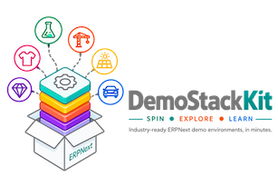

# DemoStackKit

<div align="center">
  
</div>

> Create, manage and distribute ERPNext demo environments for different industries — with a single command.

DemoStackKit is an open-source toolkit for quickly spinning up industry-specific ERPNext demo environments with realistic sample data. It includes ready-to-use demos for Garment Manufacturing, Chemical Manufacturing, Engineering Procurement & Construction (EPC), Solar Manufacturing, Auto Dealerships, Jewellery Manufacturing, and Hobby Shop & TCG Retail.

[](LICENSE)
[](https://www.python.org/)

## Index

- [What is DemoStackKit?](#what-is-demostackkit)
- [Supported Industries](#supported-industries)
- [Quick Start](#quick-start)
  - [Prerequisites](#prerequisites)
  - [Installation](#installation)
  - [Start a Demo](#start-a-demo)
  - [CLI Reference](#cli-reference)
  - [Switching ERPNext Versions](#switching-erpnext-versions)
  - [Using Different Currencies per Industry](#using-different-currencies-per-industry)
  - [Full Wipe (purge)](#full-wipe-purge)
  - [Installing Extra Apps](#installing-extra-apps)
- [Architecture](#architecture)
- [Repository Structure](#repository-structure)
- [Adding a New Industry](#adding-a-new-industry)
- [Deterministic Resets](#deterministic-resets)
- [Standard Warehouses](#standard-warehouses)
- [Opening Stock Balances](#opening-stock-balances)
- [Payroll](#payroll)
- [Project Management](#project-management)
  - [Logins for employees](#logins-for-employees)
  - [Dates drive statuses](#dates-drive-statuses)
  - [Seeding order](#seeding-order)
- [Industrywise Breakdown](#industrywise-breakdown)
  - [Garment Manufacturing](#garment-manufacturing-garment)
  - [Chemical Manufacturing](#chemical-manufacturing-chemical)
  - [Solar Energy](#solar-energy-solar)
  - [Jewellery Manufacturing](#jewellery-manufacturing-jewellery)
  - [Drones Manufacturing](#drones-manufacturing-drones)
  - [Crockery Manufacturing](#crockery-manufacturing-crockery)
  - [3D Printing Services](#3d-printing-services-print3d)
  - [EV Manufacturing](#ev-manufacturing-evmfg)
  - [Electrical Equipment Manufacturing](#electrical-equipment-manufacturing-electrical)
  - [Hobby Shop & TCG Retailer](#hobby-shop--tcg-retailer-hobbytcg)
  - [Engineering Procurement & Construction](#engineering-procurement--construction-epc)
  - [Automobile Dealership](#automobile-dealership-automobile)
  - [FMCG Distribution](#fmcg-distribution-distribution)
  - [Healthcare & Pharma](#healthcare--pharma-healthcare)
  - [Vanilla](#vanilla-vanilla)
- [Contributing](#contributing)
- [License](#license)

## What is DemoStackKit?

DemoStackKit makes it trivial to spin up a **fully seeded** ERPNext demo environment for any industry vertical. After one command, you get:

- ERPNext v15 or v16 installed and running
- A demo company configured
- Master data loaded (customers, suppliers, items, warehouses, BOMs)
- Transactional data seeded (sales orders, purchase orders, stock entries, quality inspections)
- Sample users with appropriate roles
- Dashboards, reports, workspaces and print formats
- **Ready to demonstrate immediately**

## Supported Industries

| Industry | Slug | URL | Quality Inspections |
|---|---|---|---|
| Garment Manufacturing | `garment` | http://garment.localhost | ✓ |
| Chemical Manufacturing | `chemical` | http://chemical.localhost | ✓ |
| Solar Manufacturing | `solar` | http://solar.localhost | ✓ |
| Jewellery Manufacturing | `jewellery` | http://jewellery.localhost | ✓ |
| Drones Manufacturing | `drones` | http://drones.localhost | ✓ |
| Crockery Manufacturing | `crockery` | http://crockery.localhost | ✓ |
| 3D Printing Services | `print3d` | http://print3d.localhost | ✓ |
| EV Manufacturing | `evmfg` | http://evmfg.localhost | ✓ |
| Electrical Equipment Manufacturing | `electrical` | http://electrical.localhost | ✓ |
| Hobby Shop & TCG Retailer | `hobbytcg` | http://hobbytcg.localhost | — |
| Engineering Procurement & Construction | `epc` | http://epc.localhost | — |
| Automobile Dealership | `automobile` | http://automobile.localhost | — |
| Distribution | `distribution` | http://distribution.localhost | — |
| Healthcare | `healthcare` | http://healthcare.localhost | — |
| Vanilla (clean slate) | `vanilla` | http://vanilla.localhost | — |

## Quick Start

### Prerequisites

- Docker Engine >= 24
- Docker Compose plugin >= 2.20
- Python >= 3.10
- 4 GB RAM, 10 GB disk

### Installation

```bash
git clone https://github.com/demostackkit/demostackkit.git
cd demostackkit
pip install -e .
```

### Start a Demo

```bash
# First-time setup
demostackkit init
demostackkit doctor

# Spin up any industry — examples:
demostackkit up garment    # Garment Manufacturing → http://garment.localhost
demostackkit up evmfg      # EV Manufacturing      → http://evmfg.localhost
demostackkit up print3d    # 3D Printing Services  → http://print3d.localhost
demostackkit up vanilla    # Clean slate            → http://vanilla.localhost

# Login: Administrator / admin (or any seeded user at Demo@1234)
```

### CLI Reference

```
demostackkit init              # First-time setup (creates infra/.env)
demostackkit list              # Show all available industries
demostackkit doctor            # Check host prerequisites
demostackkit use v16           # Switch active ERPNext version (v15 or v16)
demostackkit create garment    # Create Frappe site (no seeding)
demostackkit up garment        # Start stack + seed data
demostackkit down garment      # Stop stack
demostackkit reset garment     # Destroy and rebuild (deterministic)
demostackkit seed garment      # Re-run seeders
demostackkit seed garment --phase master       # Master data only
demostackkit seed garment --phase transactions # Transactions only
demostackkit up jewellery --currency USD       # Override currency at startup
demostackkit seed garment --currency INR       # Override currency for seeding
demostackkit backup garment    # bench backup
demostackkit restore garment <file>  # bench restore
demostackkit validate          # Validate all industry configs
demostackkit validate garment  # Validate one industry
demostackkit purge             # Destroy all containers and volumes
demostackkit purge --images    # Also remove pulled ERPNext images
demostackkit install-app garment hrms                          # Install app from frappe.io
demostackkit install-app garment hrms --source github --url … # Install from GitHub
demostackkit install-app garment myapp --source local --path … # Install from local directory
```

### Switching ERPNext Versions

You can run industries on either ERPNext v15 or v16. The version applies to the entire stack (all active industries share one ERPNext installation).

```bash
# Switch to v16
demostackkit use v16

# Bring down any running industry and restart it
demostackkit down garment
demostackkit up garment

# Switch back to v15 later
demostackkit use v15
demostackkit down garment
demostackkit up garment
```

The active version is stored in `infra/.env` as `ERPNEXT_VERSION`. Docker Compose uses this to pull the correct `frappe/erpnext` image tag automatically on the next `up`.

### Using Different Currencies per Industry

Each industry's default currency is set in its `industry.yaml` under `company.currency`. You can override it at runtime with `--currency` (ISO 4217 code) without touching any config files:

```bash
# Spin up EV Manufacturing with USD instead of default INR
demostackkit up evmfg --currency USD

# Spin up Jewellery with USD, 3D Printing with GBP
demostackkit up jewellery --currency USD
demostackkit up print3d --currency GBP

# Override currency when re-running seeders on an existing site
demostackkit seed evmfg --currency USD
```

The override applies to both the ERPNext setup wizard (company default currency) and all seeders.

### Full Wipe (purge)

`demostackkit purge` destroys all containers and Docker volumes (all site data). Add `--images` to also remove the cached ERPNext image layers.

```bash
# Wipe data, keep images cached (faster next startup)
demostackkit purge

# Wipe everything including images
demostackkit purge --images

# Skip confirmation
demostackkit purge --yes --images
```

Recommended workflow when switching versions:

```bash
demostackkit use v16
demostackkit purge --yes    # clear old site data
demostackkit up evmfg       # fresh v16 site — works for any industry
```

### Installing Extra Apps

Each industry can declare additional Frappe apps in `industry.yaml` under `extra_apps`. These are fetched via `bench get-app` and installed automatically on every `up`, `create`, and `reset`.

All industries ship with **HRMS** and **Helpdesk** pre-configured:

```yaml
# industries/evmfg/industry.yaml (all industries follow the same pattern)
extra_apps:
  - name: hrms          # Frappe HRMS — payroll, leaves, appraisals
    source: frappe
    branch: version-15
  - name: helpdesk      # Frappe Helpdesk — customer support tickets
    source: frappe
```

You can also add apps from GitHub or a local directory:

```yaml
extra_apps:
  - name: hrms
    source: github
    url: https://github.com/frappe/hrms
    branch: version-15

  - name: my_custom_app  # from a local directory on the host
    source: local
    host_path: /Users/me/projects/my_custom_app
```

To install an app into a **running stack** without modifying `industry.yaml`:

```bash
# From frappe.io
demostackkit install-app garment hrms
demostackkit install-app garment hrms --branch version-15

# From GitHub
demostackkit install-app garment hrms --source github --url https://github.com/frappe/hrms

# From a local directory
demostackkit install-app garment my_app --source local --path /Users/me/projects/my_app
```

If the app is already present in the bench, `get-app` is skipped and only `install-app` is run (idempotent).

## Architecture

```
Infrastructure (MariaDB, Redis, Traefik)
        ↓
ERPNext / Frappe (shared, multi-site)
        ↓
Industry Package (garment/, chemical/, ...)
        ↓
Master Data Seeders (idempotent)
        ↓
Transaction Seeders (deterministic random)
```

All industries share a **single ERPNext installation**. Each industry gets its own Frappe site (`garment.localhost`, `chemical.localhost`, etc.). This keeps memory usage at ~500 MB per additional site instead of ~5 GB per industry.

## Repository Structure

```
demostackkit/
├── demostackkit/          # Python package (CLI + framework)
│   ├── cli/               # Typer commands
│   ├── core/              # Config, discovery, exceptions
│   ├── seeder/            # BaseSeeder, runner, loader
│   ├── seeders/           # Shared seeders run for every industry
│   ├── erpnext/           # bench CLI wrapper
│   └── docker/            # compose runner, builder
├── industries/
│   ├── _template/         # Copy this to add a new industry
│   ├── garment/           # Garment Manufacturing
│   ├── chemical/
│   └── ...
├── infra/
│   └── docker-compose.yml # Master compose (shared infra + profiles)
├── tests/
└── docs/
```

## Adding a New Industry

```bash
# Scaffold from template
make new-industry SLUG=furniture

# Edit the generated files
$EDITOR industries/furniture/industry.yaml
# ... add seeders, CSV data, fixtures

# Validate and test
demostackkit validate furniture
demostackkit up furniture
```

See [docs/creating-an-industry.md](docs/creating-an-industry.md) for the full guide.

## Deterministic Resets

`demostackkit reset garment` always produces **byte-for-byte identical data**. All transactional seeders use a seeded `random.Random` instance (never `random.random()`), with the seed taken from `industry.yaml`. This makes demo environments reproducible and reliable.

## Standard Warehouses

On top of each industry's own themed warehouse tree, a shared seeder creates the exception warehouses ERPNext's stock flows expect:

| Warehouse | Seeded for | Used by |
| --- | --- | --- |
| `Scrap` | every industry | Work Order `scrap_warehouse`, write-offs and damaged stock |
| `Rejected` | every industry | Purchase Receipt / Subcontracting Receipt `rejected_warehouse` (flagged `is_rejected_warehouse`, so the field defaults to it) |
| `Rework` | industries running the **Manufacturing** module | stock sent back for repair after a failed inspection, rather than scrapped |

All three hang off `All Warehouses - <ABBR>` and are idempotent — an existing warehouse of the same name is left untouched. Nothing to configure; the seeder runs right after the industry's own Warehouse seeder.

## Opening Stock Balances

Every industry opens with stock on the shelf. A shared seeder posts an ERPNext **Opening Stock** Stock Reconciliation — one per warehouse, dated the day before the first seeded transaction — covering every stockable item, including batch- and serial-tracked ones. Stock Balance, Stock Ledger and Stock Ageing therefore have data from the moment the site comes up, and a hand-keyed Work Order has components to draw from.

Quantities are banded by unit value rather than fixed, so a bulk solvent and a machine tool both open at a plausible depth, and items with a default BOM are treated as finished goods (smaller quantities, finished-goods warehouse). Tune per industry in `industry.yaml`:

```yaml
seed:
  opening_stock:
    enabled: true            # false to skip opening balances entirely
    warehouse: "Stores"      # purchased/raw items — ' - ABBR' is appended
    fg_warehouse: "Finished Goods"   # items with a default BOM
    qty_scale: 1.0           # dial down for small retail (hobbytcg uses 0.03)
```

The seeder is idempotent: items that already carry a Stock Ledger Entry are skipped, so re-running tops up a partially seeded site instead of double-counting.

## Payroll

Industries that seed employees can also seed payroll, so HRMS opens with a payable workforce rather than an empty Payroll Entry. The seeder creates, in order: a **Holiday List** (set as the company default — no Salary Slip can be raised without one), the **Salary Components** the structure needs, a submitted **Salary Structure**, and a submitted **Salary Structure Assignment** for every active employee. It is idempotent; anything that already exists is left alone.

The industry seeder carries only one table — annual cost to company per designation:

```python
ANNUAL_CTC = {
    "Production Manager": 1_140_000,
    "Plant Operator": 384_000,
    ...
}
```

Everything else comes from `demostackkit/seeder/payroll.py`, which picks a convention from the company's **country**:

| | Monthly (default) | Hourly (United States) |
| --- | --- | --- |
| Payroll frequency | Monthly | Weekly |
| Salary Structure | one, for the whole workforce | one per designation — HRMS holds `hour_rate` on the structure, so a shared one would pay every role the same |
| Timesheets | not used | `salary_slip_based_on_timesheet`, hours paid against **Basic** at `annual ÷ 2080` |
| Assignment `base` | one month's CTC | one week at the hourly rate |
| Earnings | Basic, House Rent Allowance, Conveyance Allowance, Special Allowance | Basic, Overtime |
| Deductions | Provident Fund, Professional Tax, Income Tax | Federal Income Tax, Social Security, Medicare, Retirement Savings |
| Weekly off | Sunday | Saturday and Sunday |

**Every US demo runs payroll hourly off timesheets** — that rule lives in `HOURLY_PAYROLL_COUNTRIES` and applies wherever the seeder is rolled out, without the industry having to know about it.

Structure rows are formulas over `base` and earnings always sum to it, so an assignment's `base` reads as gross pay for the period. Formulas never reference another component's abbreviation: HRMS rejects a formula that reads a payment-days-dependent component while itself depending on payment days, since the amount would be prorated twice.

Seeded for all industries. Each industry carries a thin `12_payroll.py` with its own `ANNUAL_CTC` table; shared run logic lives in `demostackkit/seeder/payroll_seeder.py`. US demos (`print3d`, `hobbytcg`, `vanilla`) use hourly/timesheet payroll automatically from their company's country.

| Industry | Payroll convention |
| --- | --- |
| `automobile`, `chemical`, `crockery`, `distribution`, `drones`, `electrical`, `epc`, `evmfg`, `garment`, `healthcare`, `jewellery`, `solar` | Monthly (India) |
| `hobbytcg`, `print3d`, `vanilla` | Hourly / timesheet (United States) |

## Project Management

Every industry seeds a live project portfolio, so the Projects workspace, the Gantt chart and the Kanban board open with something worth showing rather than an empty list.

Each industry gets **four projects at deliberately different stages** — one nearly handed over, one mid-execution, one just kicked off, and one that ERPNext generates itself from a **Project Template**, which is what proves the template → project flow actually works. Around them sit industry-specific **Project Types** and **Task Types**, a shared **Kanban Board**, and **Timesheets** booked against tasks so project costing is not zero.

What every hand-authored project carries:

| | |
| --- | --- |
| **Group tasks** | one per phase (`is_group`), spanning its whole subtree |
| **Dependencies** | `depends_on` chains across phases, so the Gantt draws real arrows |
| **Assignment** | every unfinished task assigned to a seeded employee's login via ToDo |
| **Status spread** | Open, Working, Pending Review, Overdue, Completed and Cancelled all populated |
| **Priorities** | Low through Urgent, mixed across the tree |

### Logins for employees

Tasks are assigned to Users, but seeded Employees arrive with no `user_id`. A shared seeder (`demostackkit/seeders/01_master/84_employee_users.py`) creates one login per employee (`first.last@<slug>.demo`, password from `seed.demo_password`), links `Employee.user_id`, and grants **`Projects User`** — `task.json` grants read/write to that role and nothing else, so without it every assignment silently becomes a document share instead.

It deliberately sets `create_user_permission = 0`. ERPNext's default of `1` restricts each login to its own Employee record, which cascades into Timesheet, Leave and Attendance and makes a demo site look broken to anyone who signs in to look around.

### Dates drive statuses

An industry blueprint declares each task as an offset and a duration from the project start; `demostackkit/seeder/projects.py` turns that into dates and derives the status from where the window falls. A blueprint may hint at a status, but only one that is *stable* for that window — an Open task whose end date has already passed gets flipped to Overdue by ERPNext's daily `set_tasks_as_overdue` job within a day of the demo being stood up, quietly draining the Kanban column.

| Task window | Default status | Hints allowed |
| --- | --- | --- |
| Ends before today | `Completed` | `Overdue`, `Cancelled` |
| Spans today | `Working` | `Open`, `Pending Review` |
| Starts after today | `Open` | — |

`tests/unit/test_industry_data_integrity.py` expands every blueprint in every industry and checks the result would survive ERPNext's own validation. A task completed before its dependencies, a phase ending before its children, an undeclared task type or a designation nobody holds all fail in CI rather than halfway through a live seed run.

### Seeding order

The order here is forced by ERPNext, not chosen: `Task.validate_status` rejects a Completed task whose dependencies are unfinished — on a fresh insert too, since `get_db_value` returns `None` for a new document — and submitting a Timesheet promotes an Open task to Working. So tasks go in `Open` in dependency order, timesheets land, and only then does the status pass run.

| Priority | Seeder | |
| --- | --- | --- |
| 84 | `01_master/84_employee_users.py` | logins and `Employee.user_id` |
| 88 | `01_master/13_projects.py` | Project Types, Task Types, Project Templates |
| 240 | `02_transactions/04_projects.py` | Projects, phase/task trees, dependencies |
| 250 | `02_transactions/250_timesheets.py` | Activity Type rates, submitted Timesheets |
| 260 | `02_transactions/260_task_finalize.py` | final statuses, then assignments |
| 270 | `02_transactions/270_kanban_boards.py` | the **Project Tasks** Kanban board |

The four shared seeders run for every industry and no-op when no projects were seeded. Each industry carries only data — `01_master/13_projects.py` for types and templates, `02_transactions/04_projects.py` for the blueprints — with the run logic in `demostackkit/seeder/project_seeders.py`, the same split payroll uses.

Volumes are tunable per industry: `seed.volumes.projects` trims the portfolio and `seed.volumes.timesheets` caps the time logs.

Open the board at `/app/task/view/kanban/Project Tasks`, or a project's Gantt from `/app/project`.

## Industrywise Breakdown

### Garment Manufacturing (`garment`)

Alpha Garments Pvt Ltd — apparel manufacturer producing T-shirts, shirts, jeans, jackets, and dresses through a complete cut-make-trim workflow. Includes:

- **7 workstations** — Cutting Table, Sewing Machine, Overlock Machine, Button Machine, Pressing Station, QC Table, Packaging Station
- **Single CMT routing** — 7 sequential operations totalling ~2.5 hrs per garment
- **11 finished-goods BOMs** — fabric + thread + trims + packaging per garment type
- **Quality inspections** — thread count, tensile strength, colour fastness, shrinkage (30 QIs, 85% pass rate)
- **Payroll** — plant employees on a submitted monthly Salary Structure, each with a submitted Salary Structure Assignment (see [Payroll](#payroll))
- **HR & Payroll enabled** — 20 customers, 15 suppliers, 50 sales orders, 30 purchase orders
- **Projects** — AW26 Collection Development; Export Buyer Order Ramp - Nordwear; SEDEX Compliance Audit; plus SS27 Capsule Line generated from the "Seasonal Collection Development" Project Template

### Chemical Manufacturing (`chemical`)

Alpha Chemicals Pvt Ltd — batch-process chemical manufacturer covering raw material procurement, formulation, quality testing, and finished goods dispatch. Includes:

- **Batch production** — manufacture orders against BOMs with raw material consumption by weight and volume
- **Quality management** — chemical composition, viscosity, pH, and purity inspection parameters
- **50 sales orders, 30 purchase orders** — industrial buyers and chemical raw material vendors seeded over 180 days
- **25 quality inspections** across incoming, in-process, and outgoing stages
- **Payroll** — 11 plant employees on a submitted monthly Salary Structure, each with a submitted Salary Structure Assignment (see [Payroll](#payroll))
- **Projects** — Specialty Resin Scale-up - RX-400; Reactor-3 Turnaround; REACH Registration - Export Grades; plus Pilot Batch Qualification - Additive AD-9 generated from the "Process Scale-up Protocol" Project Template

### Solar Energy (`solar`)

SunPower Solar Pvt Ltd — solar equipment distributor and EPC contractor. Covers panel and inverter procurement, balance-of-system components, battery storage, and project-based customer installations. Includes:

- **Projects module** — project-linked sales orders with milestone billing for installation contracts
- **BOMs with routing** — panel assembly workstations and operations for system integration
- **Items across technologies** — monocrystalline panels, string/micro inverters, MPPT charge controllers, lithium battery banks, mounting structures
- **12 customers, 10 suppliers** — EPC contractors, housing societies, commercial buyers, equipment vendors
- **Projects** — 2 MW Ground-Mount Farm - Jodhpur; 500 kW Factory Rooftop - Chakan; Annual O&M Contract - Western Cluster; plus Residential Rooftop Cluster - Kothrud generated from the "Rooftop Solar Installation" Project Template

### Jewellery Manufacturing (`jewellery`)

GoldStar Jewellers Pvt Ltd — jewellery manufacturer and wholesaler producing gold, silver, diamond, and platinum pieces. Covers precious metal procurement by weight, gemstone inventory, manufacturing orders, and retail/wholesale sales. Includes:

- **Precious metal procurement** — gold alloy, silver granules, platinum by gram and troy oz
- **Gemstone inventory** — diamonds, rubies, emeralds, sapphires tracked by carat and quality grade
- **Manufacturing BOMs** — rings, necklaces, bangles, earrings with metal + stone + setting components
- **50 sales orders** — retail boutiques and wholesale buyers across 180 days
- **Projects** — Bridal Collection Launch - Vivaha; Bespoke Commission - Mehta Necklace Set; India Jewellery Show - Mumbai; plus Festive Collection - Deepavali generated from the "Collection Development" Project Template

### Drones Manufacturing (`drones`)

SkyForge Drones Pvt Ltd — drone manufacturer covering component procurement, PCB and frame assembly, firmware calibration, flight testing, quality inspection, and dispatch. Includes:

- **Full assembly routing** — from component sourcing through PCB assembly, frame build, calibration, and flight test
- **Quality inspections** — flight performance, sensor accuracy, communication range, hover stability (25 QIs)
- **HR & Payroll enabled** — 15 customers, 10 suppliers, 40 sales orders, 25 purchase orders
- **Featured reports** — Drone Assembly Report, Component Consumption Report
- **Projects** — Agri-Spray Drone NPD - AgriHawk 8L; DGCA Type Certification - SurveyWing; Survey Fleet Deployment - NHAI Corridor; plus Payload Variant NPD - Thermal Pod generated from the "Drone NPD Programme" Project Template

### Crockery Manufacturing (`crockery`)

PotteryPro Ceramics Pvt Ltd — ceramics and crockery manufacturer covering clay procurement, throwing, casting, bisque firing, glazing, and kiln firing. Includes:

- **Multi-stage kiln routing** — throwing/casting → bisque firing → glaze application → glaze firing → QC inspection
- **Quality inspections** — glaze coverage, dimensional tolerance, chip resistance, colour consistency (20 QIs)
- **HR & Payroll enabled** — 12 customers, 8 suppliers, 40 sales orders, 20 purchase orders
- **Featured reports** — Kiln Firing Report, Glaze Consumption Report
- **Projects** — Stoneware Dinnerware Launch - Terra Series; Kiln-2 Refractory Rebuild; Flagship Store Rollout - Bandra; plus Glazed Serveware Launch - Monsoon generated from the "Collection Development" Project Template

### 3D Printing Services (`print3d`)

A 3D print farm (PrintForge 3D Services) taking customer orders for parts printed via FDM (fused deposition modeling) and SLA (stereolithography) technologies. Includes:

- **Printers modelled as workstations** — FDM Printer Bank, SLA Printer Bank, Washing Station, UV Curing Chamber, Post-Processing Bench
- **Two production routings** — FDM Standard Route (5 steps) and SLA Standard Route (7 steps, adding IPA washing and UV curing)
- **Material procurement** — filaments (PLA, ABS, PETG, TPU) and resins (standard, engineering, ABS-like) with correct UOM per material (Kg / Litre)
- **9 finished-goods BOMs** — small/medium/large prototypes, functional parts, display models, each linked to its routing
- **Quality inspections** — dimensional accuracy (mm), surface roughness Ra (μm), layer adhesion, print completion (%)
- **Projects** — Aerospace Bracket Prototype Programme; Dental Aligner Batch Run - Q3; SLS Cell Installation; plus Automotive Jig Prototype Run generated from the "Prototype Delivery Programme" Project Template

### EV Manufacturing (`evmfg`)

Voltara EV Manufacturing Pvt Ltd — Indian EV manufacturer producing both electric cars and electric bikes. The central demo story is **shared component procurement** — the DC-DC converter, CCS2 charging port, instrument cluster, HV contactor, HV fuse, disc brake assemblies, copper busbars, and thermal pads all appear in BOMs for both vehicle families, naturally driving consolidated purchasing scenarios. Includes:

- **3 electric cars** — Sedan (72 kWh dual-motor), SUV (90 kWh dual-motor), Hatchback (54 kWh single-motor)
- **3 electric bikes** — Sport, City Commuter, Cargo; each using 18650-cell packs and hub motors
- **Two manufacturing routings** — EV Car Route (9 steps, ~40 hrs) and EV Bike Route (8 steps, ~6.5 hrs)
- **6 BOMs with 19–21 components each** — car BOMs use 21700 cells + 60 kW PMSM motors; bike BOMs use 18650 cells + 3 kW hub motors
- **Split sales order generation** — 40% car orders (qty 1–3, ₹12–22 lakh, 30–90 day lead) and 60% bike orders (qty 1–15, ₹80k–1.8 lakh, 7–30 day lead)
- **Projects** — 2W Powertrain NPD - Volt 3.5kW; Battery Pack Line Commissioning; ARAI Homologation - Voltara City; plus Fleet Variant NPD - Cargo 2W generated from the "EV Product Development" Project Template

### Electrical Equipment Manufacturing (`electrical`)

PowerTech Electrical Pvt Ltd — switchgear and transformer manufacturer producing distribution transformers (100kVA–500kVA), power transformers (1MVA), HT switchgear panels (11kV), LT distribution panels (415V), and motor control centres. Covers a project-driven B2B sales cycle where state electricity boards and EPC contractors place high-value made-to-order contracts. Includes:

- **Two manufacturing routings** — Transformer Route (7 steps: coil winding → core lamination → assembly → tank fabrication → oil filling → HV testing → packing) and Switchgear Route (3 steps: panel assembly → HV testing → packing)
- **7 BOMs** — 4 transformer BOMs (100kVA, 250kVA, 500kVA, 1MVA) and 3 switchgear panel BOMs (HT 11kV, LT 415V, MCC 415V); each with domain-accurate copper, CRGO steel, and insulating oil quantities
- **Split sales order generation** — 60% transformer orders (qty 1–5, 60–120 day lead) and 40% switchgear orders (qty 1–3, 30–60 day lead)
- **Electrical quality parameters** — turns ratio error (%), insulation resistance (MOhm), oil breakdown voltage (kV), and load loss (W)
- **12 customers** — state electricity boards (MSEDCL, KSEB, TSSPDCL), EPC contractors (L&T, Tata Projects), industrial consumers, and export partners
- **Projects** — LV Switchgear NPD - PowerLine 630A; 11kV Panel Build - Textile Park; IEC 62271 Type Test Campaign; plus Distribution Transformer NPD - 250 kVA generated from the "Electrical NPD Programme" Project Template

### Hobby Shop & TCG Retailer (`hobbytcg`)

Nexus TCG & Hobbies — a US-based hybrid hobby shop and trading card game retailer operating B2C brick-and-mortar, e-commerce, and B2B wholesale channels. Covers the full TCG retail lifecycle from distributor purchasing to high-value card sales. Includes:

- **Batch-tracked sealed product** — booster boxes and cases for Pokémon, Magic: The Gathering, and Yu-Gi-Oh! (release wave and pre-order allocation tracking)
- **Serial-tracked graded cards** — PSA/BGS/CGC certified cards (Charizard PSA 10, Black Lotus PSA 9, Blue-Eyes White Dragon PSA 10) each assigned a unique cert number for high-value traceability
- **Standard stock singles and accessories** — raw NM/LP singles across all three TCGs plus Dragon Shield sleeves, Ultra PRO playmats, deck boxes, toploaders, and binders
- **Non-stock service items** — tournament entry fees (FNM, Regionals), game table rental, and card grading submission fees
- **Three-warehouse layout** — Front-of-House Retail Store (POS), Backroom Sealed Inventory (bulk/case storage), The Vault (rare and graded cards)
- **18 customers** — walk-in retail players, online buyers, and B2B wholesale LGS accounts (Cards & Comics Corner, Dragon's Lair Austin, Mythic Realm Games)
- **8 suppliers** — TCG distributors (ACD, Alliance, GTS, Southern Hobby), accessory vendors (Ultra PRO, Dragon Shield/Arcane Tinmen, BCW), and grading services (PSA)
- **30 purchase orders** — distributor restocks of sealed product and singles with realistic ±10% price variance
- **50 sales orders** — split ~50% sealed product, ~30% singles, ~20% accessories with TCG-appropriate retail markups
- **Projects** — Second Store Launch - Riverside; Regional Tournament Series - Spring Circuit; Holiday Season Programme; plus Pop-up Booth - Comic Expo generated from the "Store Launch Playbook" Project Template

### Engineering Procurement & Construction (`epc`)

BuildRight EPC Pvt Ltd — EPC company running project-based operations covering material procurement per site, equipment tracking, sub-contractor billing, and milestone-based customer invoicing. No manufacturing. Includes:

- **Projects module** — project costing, milestone tracking, and material consumption linked per project
- **Pure procurement + billing** — no BOMs or production orders; workflow is PO → stock → project billing
- **50 sales orders, 30 purchase orders** — project milestones and material POs over 180 days
- **Featured reports** — Project Costing Report, Material Procurement Summary
- **Projects** — 220kV Substation Package - Nashik; Industrial Warehouse Shell - Bhiwandi; Water Treatment Plant Upgrade - Pune; plus Metro Depot MEP Fit-out - Wadala generated from the "MEP Retrofit Package" Project Template

### Automobile Dealership (`automobile`)

AutoDrive Motors Pvt Ltd — automobile dealership and service centre. Vehicle sales, spare parts procurement, lubricants, tyres, and fleet customer management — no manufacturing. Includes:

- **Sales-focused** — vehicles as stock items sold directly; no BOMs or production orders
- **Spare parts inventory** — multi-category parts catalogue across vehicle makes and models
- **20 customers, 15 suppliers** — fleet operators, individual buyers, OEM and aftermarket parts vendors
- **50 sales orders** — vehicle and parts sales with Featured reports: Vehicle Sales Report, Spare Parts Consumption
- **Projects** — Service Bay Expansion - Andheri Workshop; Recall Campaign - Model X Brake Actuator; Dealer DMS Rollout; plus Annual Service Camp - Pune generated from the "Service Campaign Playbook" Project Template

### FMCG Distribution (`distribution`)

QuickMove Distributors Pvt Ltd — FMCG distributor procuring from brands and fulfilling orders to supermarket chains and retail customers. No manufacturing. Includes:

- **High-volume trade flow** — 50 sales orders, 30 purchase orders across 20 customers and 15 suppliers
- **Multi-warehouse stock management** — regional warehouses with dispatch area and stock ageing tracking
- **Order fulfilment focus** — procurement, stock receipts, and delivery notes as the primary workflow
- **Featured reports** — Stock Ageing, Delivery Note Trends, Purchase Analytics
- **Projects** — Regional DC Commissioning - Nagpur; Tier-2 Route Expansion - Vidarbha; Festive Trade Programme - Diwali; plus Satellite Depot Setup - Aurangabad generated from the "Depot Commissioning" Project Template

### Healthcare & Pharma (`healthcare`)

MedCare Healthcare Pvt Ltd — healthcare and pharmaceutical distributor covering medicine procurement, medical device stock, pharmacy dispensing, and hospital supply chain. Includes:

- **Healthcare module enabled** — patient registration, prescriptions, and clinical procedures
- **Pharma inventory** — medicines tracked by batch and expiry, controlled substance handling
- **Medical devices** — surgical instruments, diagnostic equipment, PPE alongside medicines
- **12 customers** — hospitals, clinics, pharmacies, and institutional buyers
- **Projects** — New OPD Wing Commissioning; NABH Accreditation Programme; Diabetes Care Programme Launch; plus Day-Care Dialysis Unit Setup generated from the "Clinical Facility Commissioning" Project Template

### Vanilla (`vanilla`)

A minimal environment with only a company (Acme Corp) and demo users created — no industry master data or transactions are seeded. Use this as a clean slate for custom demonstrations, onboarding sessions, or interactive workshops where the audience populates data live.

The cross-industry seeders still run, so the site is not entirely bare: it carries a small workforce with logins, payroll, and a generic project portfolio — ERP Rollout - Phase 1; Website Revamp; Office Relocation; plus Customer Portal Pilot generated from the "Standard Delivery Programme" Project Template. Projects use ERPNext's own `Internal` and `External` project types rather than declaring new ones.

```bash
demostackkit up vanilla
demostackkit up vanilla --currency EUR   # currency override works as usual
```

## Contributing

See [CONTRIBUTING.md](CONTRIBUTING.md). All contributions welcome — especially new industry packages!

## License

MIT © DemoStackKit Contributors
